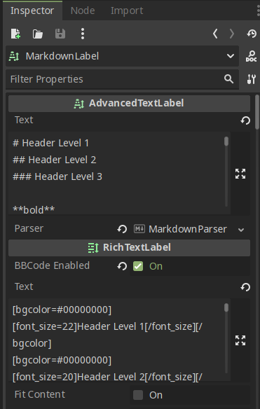

# AdvancedTextLabel

This class parses given text to bbcode using given TextParser

Extends **[RichTextLabel](https://docs.godotengine.org/en/4.2/classes/class_richtextlabel.html)**

## Vars

### \_text

!!! note

    It will be display as`Text` in **Inspector**

Text to be parsed in too BBCode.
Use it instead of `text` from RichTextLabel.
I had to make this way as Godot doesn't allow
to override `text` var behavior.

### parser

Text to be parsed in too BBCode.
Use it instead of `text` from RichTextLabel.
I had to make this way as I can't override `text` var behavior.
TextParser that will be used to parse `_text`.

## Signals

### custom_link

- url: String

By default links (staring from `http`) will be opened in web browser.
For custom links you can connect to `custom_link` signal.
